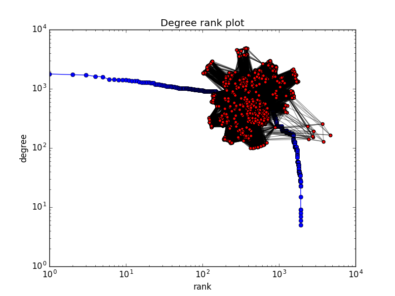

# Data Science and the Nations Event Data
Data used during the event [Data Science meets the Nations](https://www.facebook.com/events/1804163043167931/).
## Requirements
Please make sure that you have *Python* and *pip* are installed on your machine. The version of Python we used was version 2 to support plotting with matplotlib. Using Python3 would be a better choice to avoid unicde problems (you can use plotly for plotting as well).
The requirements for this projects are all contained in the ```requirements.txt``` file. Once you have pip installed to install the reauirements please use the command:
```pip install -r requirements.txt```

## Data Structure
All the data is stored in CSV format.
### Uplands Nation Event Attendance Data
This data is present under the folder _event_data/_.

Each filename in the _event_data/_ folder is in form: **_[DATE]_ + _[NAME]_.csv**. The first line of each file is a header in the form: "Name,Status", while the rest of the rows contain names and statuses of people attending the event on Facebook.
The status can be either of the following: *Going*, *Maybe* or *Invited*.

For example the event _Cleaning Day II_ that happened on the 6th of March is stored in the file **"MAR 6 Cleaning Day II"**. The lines in this file look something like this:
```
Name,Status
"Carl Gustav",Going
"Luke Skywalker",Going
"Batman Batman",Maybe
...
```

### Purchase Data from Foobar
This data is present in the file _purchase_data/purchases.csv_.

The first lines of this file look like this:
```purchase_id,product_id,name,qty,date_created
"4996478d-d93d-4c53-bc6f-55dcc9c141b1","883ecf58-3504-4eca-bc8d-6f30aea70bbc","Kaffe","1","2016-09-01 06:25:30.236768+00"
"ae331889-aa15-434d-92ec-9b31910fc9c9","883ecf58-3504-4eca-bc8d-6f30aea70bbc","Kaffe","1","2016-09-01 06:52:53.590181+00"
"b0558914-58ff-456b-993d-0091d5f22b0d","883ecf58-3504-4eca-bc8d-6f30aea70bbc","Kaffe","1","2016-09-01 07:50:50.680759+00"
```

## Analyzing the Data
### Association Rules on Purchase data
Association rule mining can help us understand what things are bought together, this can help for example in giving customers a recommendation when they buy a product.
To understand the basic concepts of Association Rule Mining you can have a look at [this article by KDNuggets](http://www.kdnuggets.com/2016/04/association-rules-apriori-algorithm-tutorial.html).

_**Note:**_ _The purchase dataset is not large enough (in terms of how many sets of items purchased together we have) to conclude on these behaviors._

We find out the following things for example:
The rule ```'Lasagnetta' --> 'Loka Citron'``` has a confidence of **0.5** and a lift of around **34** (The support value is around 0.0014 which means that around 0.14% of the datasets contain this set). This could be interpreted by saying that most people who buy a Lasagnetta will buy a Loka Citron (at least in this dataset). 
On the other hand ```'Tropi Cube' --> 'Loka Citron' ``` has a confidence of **1.0** and a lift of around **68**. Since the confidence is 1, then the only time Tropi Cube was purchased was when it was purchased with Loka Citron.
In the same time we find that ```'Mjölk' --> 'Kaffe' ``` has a confidence of **0.9** and a lift of around **6.5**. This means that when people buy milk, it's usually with coffee, but because coffee is a common purchase the lift value is quite small.

### Graph Clustering on Nation Event Data
Unfortunately, the time was not enough to create clusters on the data but what we are going to do first is analyze the structure of the event attendance to deduce a graph. We consider as a rule that any person who said either 'Maybe' or 'Going' are connected to each other (After changing this rule to either just 'Going' or just 'Maybe' we find almost the same results).
After deducing the graph we start by validating our assumptions. First, we check whether it resembles a real life graph by having a look at [assortativity](https://en.wikipedia.org/wiki/Assortativity) and [degree distribution](https://en.wikipedia.org/wiki/Degree_distribution) to check if the graph is similar to a real life graph.
The [assortativity](https://en.wikipedia.org/wiki/Assortativity) of this graph is equal to **0.4** which is a very high value. Real life networks tend to have a high value for assortativity which can be interpreted by saying that similar people tend to connect to each other. We also observe that the degree distribution is heavy tailed. The last two results show that the graph we considered can be considered as a real life graph.

We also take a look at [betweenness](https://en.wikipedia.org/wiki/Betweenness_centrality) and degree centralities to check if we can find interesting people. We find that people who work at Uplands have very high centralities. Surprisingly we also find that a person who has a very high betweenness while having a low degree centrality. This type of people is usually (in a real life graph) considered as very interesting because while the person is not popular in the sense that they do not have a huge number of connections (deduced from their degree) the person still has a very high influence (a high betweenness implies that if the person disappears the people are going to be less connected in some sense).

For even more cool stuff, [subscribe to my mailing list here](www.ismail.land/subscribe.html):
http://ismail.land/subscribe.html
